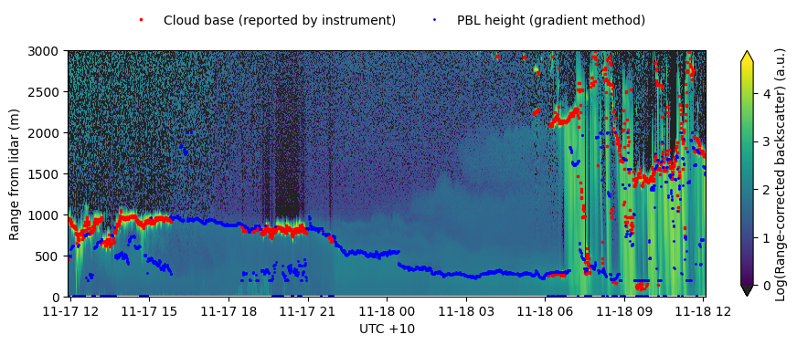

# clanalysis

clanalysis is a tool for performing some limited analysis and visualisation of Vaisala
CL51 and CL31 ceilometer data in NetCDF format.

## Purpose and how to use

```
usage: clanalysis [-h] [--debug] [-st START_TIME] [-et END_TIME] [-tz TIMEZONE_OFFSET] input [input ...] output

Detect PBL in Vaisala CL51 NetCDF files and generate plots. The name of the output file determines what action is taken: if the output ends with .csv, then boundary layer and cloudbase information is written to a csv
file. Similarly, if the output has the special name 'stdout' the same comma-separated data is sent to standard output. Plots are generated if the output file ends with .pdf or .png.

positional arguments:
  input                 input files
  output                output file

optional arguments:
  -h, --help            show this help message and exit
  --debug               print debugging information
  -st START_TIME, --start_time START_TIME
                        Start time for display, same timezone as source files, format YYYYMMDDHHMM
  -et END_TIME, --end_time END_TIME
                        End time for display, same timezone as source files, format YYYYMMDDHHMM
  -tz TIMEZONE_OFFSET, --timezone_offset TIMEZONE_OFFSET
                        Timezone Offset. Add this many hours to the time in the source files before displaying plots (e.g. for conversion from UTC to local time). NOTE: does not affect CSV output.


```

## Examples

Generate a plot, midday to midday, source data in UTC

```sh
$ clanalysis -st 202111170155 -et 202111180205 -tz 10 ../data/L1_94954_202111170000.nc ../data/L1_94954_202111180000.nc sample_plot.png
```



Using the same data, extract timeseries of the cloudbase, planetary boundary-layer height (determined using the gradient method), and the magnitude of the vertical gradient at the top of the PBL.

```sh
$ clanalysis -st 202111170155 -et 202111180205 \
        -tz 10 \
        ../data/L1_94954_202111170000.nc \
        ../data/L1_94954_202111180000.nc \
        stdout
time,cloudbase,pbl_height,vertical_gradient_at_pblh
2021-11-17 01:55:09,450.0,10.0,0.0
2021-11-17 01:55:45,950.0,500.0,444.0
2021-11-17 01:56:21,930.0,500.0,357.0
2021-11-17 01:56:57,940.0,500.0,257.0
2021-11-17 01:57:33,940.0,500.0,165.5
2021-11-17 01:58:09,930.0,500.0,95.0
2021-11-17 01:58:45,930.0,500.0,48.5
2021-11-17 01:59:21,940.0,500.0,22.0
...
```

## Installation

Install from github into Python environment (conda, venv, pipenv)

```sh
$ git clone https://github.com/agriff86/cl-analysis.git
$ cd cl-analysis
$ pip install -e .
```


## License

This software is open source and can be used, shared and modified freely
under the terms of the MIT License (see [LICENSE.md](LICENSE.md)).


## Changelog

No releases


## See also

[cl2nc](https://github.com/peterkuma/cl2nc)
